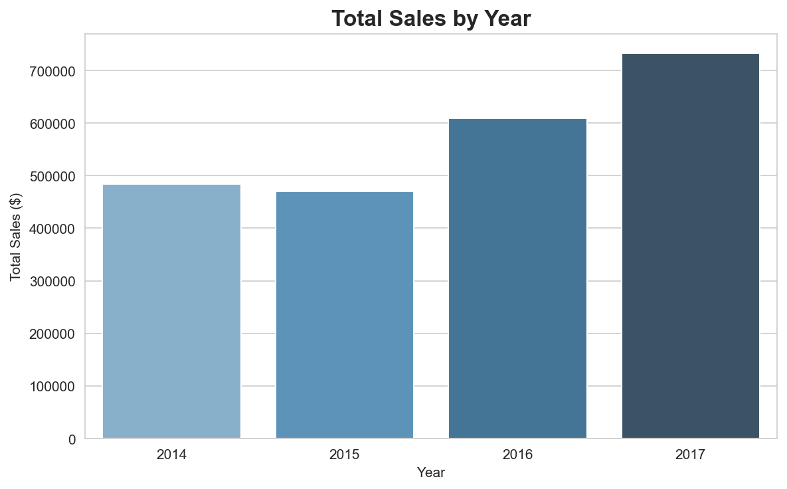
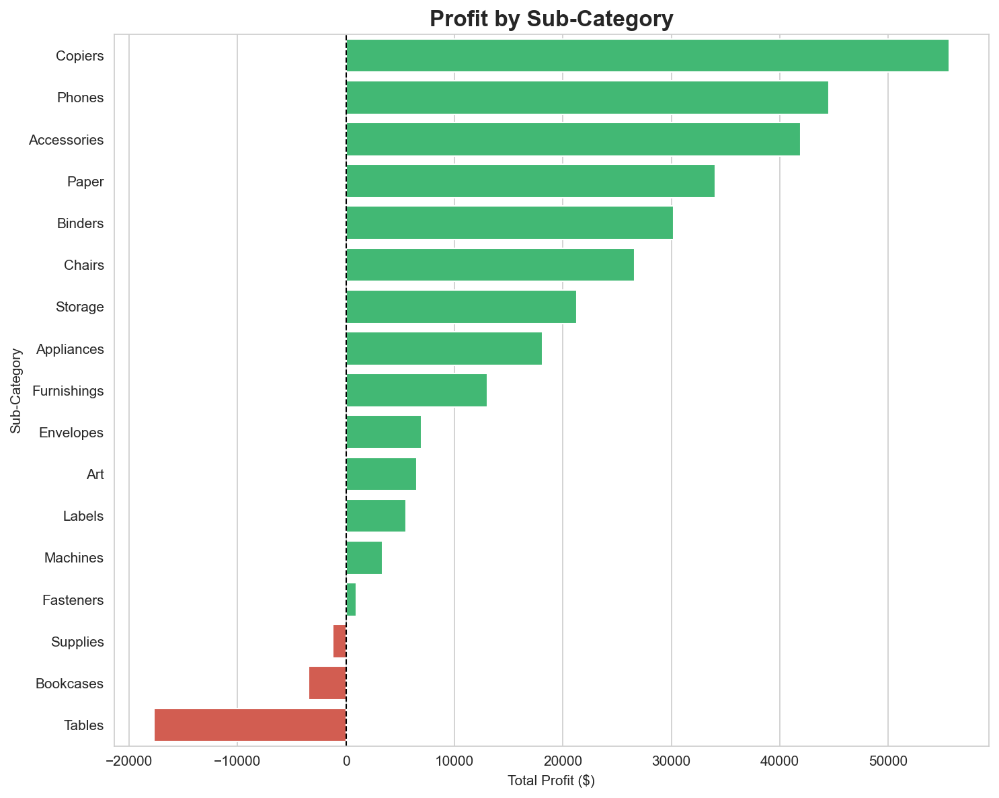
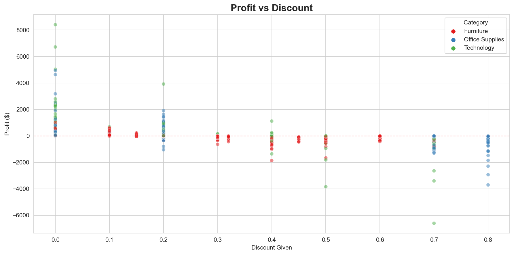

# superstore-sales-analysis
Sales Data Analysis project using Python - EDA, Visualization and Business Insights
# 🛒 Superstore Sales Analysis


## 📌 Project Overview
A comprehensive sales data analysis project using Python and Jupyter Notebook. 
This project explores 9,994 transactions from a US-based retail superstore 
covering 2014 to 2017, uncovering key business insights around sales performance, 
profitability, customer behavior and discount impact.

---

## 📊 Key Findings

| Metric | Value |
|---|---|
| Total Sales Revenue | $2,297,200.86 |
| Total Profit | $286,397.02 |
| Overall Profit Margin | 12.03% |
| Total Orders | 5,009 |
| Total Customers | 793 |
| Top Category | Technology |
| Top Region | West |
| Top Customer | Sean Miller |
| Best Sub-Category | Copiers |
| Loss-making Sub-Categories | Tables, Bookcases, Supplies |
| Peak Sales Months | August & November |
| Slowest Month | January |

---

## 🔍 Analysis Performed

- ✅ Exploratory Data Analysis (EDA)
- ✅ Feature Engineering — Ship Delay, Profit Margin, Time Features
- ✅ Sales Trend Analysis — Yearly and Monthly
- ✅ Category and Sub-Category Profitability Analysis
- ✅ Geographic Sales Performance by Region
- ✅ Customer Segmentation and Top Customer Analysis
- ✅ Discount Impact on Profit Analysis
- ✅ Business Recommendations

---

## 📁 Project Structure
```
superstore-sales-analysis/
│
├── sales_analysis.ipynb    # Main Jupyter Notebook
├── superstore.csv          # Dataset
│
├── charts/                 # All visualization images
│   ├── chart1_sales_by_year.png
│   ├── chart2_monthly_trend.png
│   ├── chart3_sales_category.png
│   ├── chart4_sales_region.png
│   ├── chart5_profit_discount.png
│   ├── chart6_top_customers.png
│   ├── chart7_profit_category.png
│   ├── chart8_profit_subcategory.png
│   ├── chart9_profit_segment.png
│   └── chart10_discount_impact.png
│
└── report/                 # Business report
    └── Superstore_Sales_Analysis_Report.pdf
```

---

## 📈 Sample Visualizations

### Sales by Year


### Profit by Sub-Category


### Profit vs Discount


---

## 🛠️ Tools & Libraries Used

| Tool | Purpose |
|---|---|
| Python 3.8+ | Core programming language |
| Pandas | Data manipulation and analysis |
| NumPy | Numerical computations |
| Matplotlib | Data visualization |
| Seaborn | Statistical visualizations |
| Jupyter Notebook | Development environment |
| Microsoft Word | Business report writing |

---

## 💡 Business Recommendations Summary

1. 🚨 **Revise Discounting Strategy** — Cap discounts at 20% maximum
2. 📱 **Invest in Technology** — Highest profit category, expand Copiers range
3. 🪑 **Fix Loss-making Products** — Review pricing for Tables and Bookcases
4. 📅 **Capitalize on Seasonality** — Prepare stock for August and November peaks
5. 🗺️ **Develop South Region** — Replicate West region success strategies
6. 👑 **Protect Top Customers** — Implement VIP program for top 20 customers

---

## 📂 Dataset Information

- **Source:** Superstore Sales Dataset
- **Records:** 9,994 rows × 21 columns
- **Period:** 2014 – 2017
- **Region:** United States

---

## 👤 Author

**[BRYSON A NKINDA]**
Data Scientist | Python | Machine Learning | Data Visualization

[](your-linkedin-url)
[](your-github-url)

---

*This project is part of my Data Science portfolio. 
Feel free to explore the notebook and report for detailed analysis!*
```

---

6. Scroll down to **"Commit changes"**
7. Type this commit message:
```
Add professional README with project overview and findings
